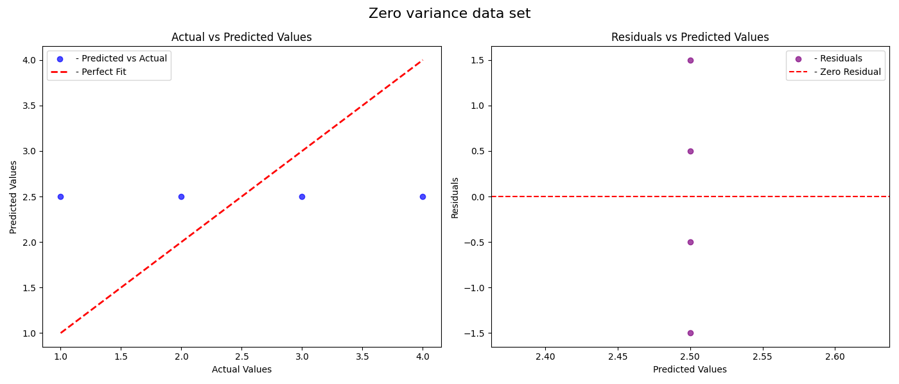
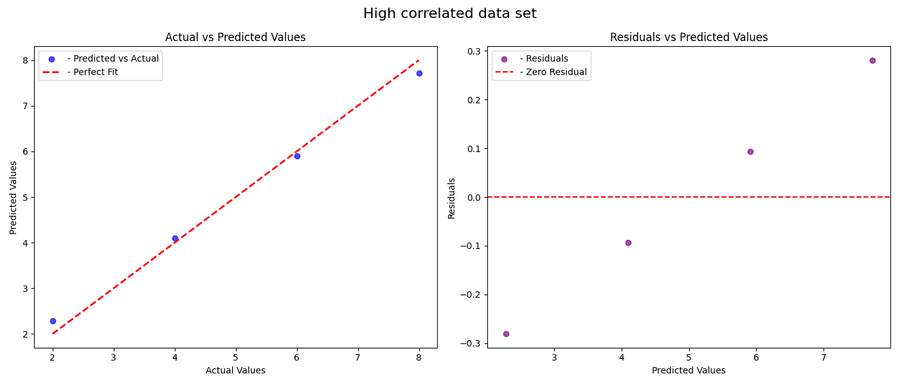
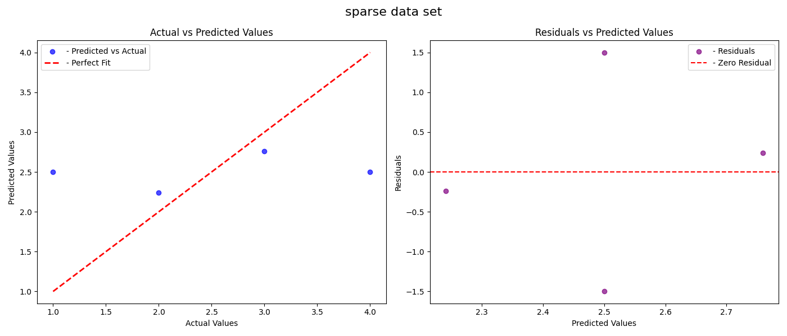
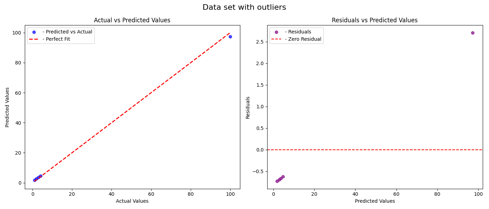
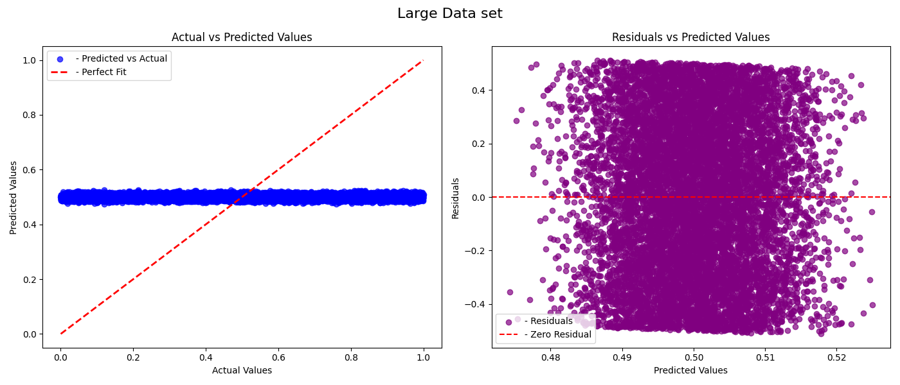
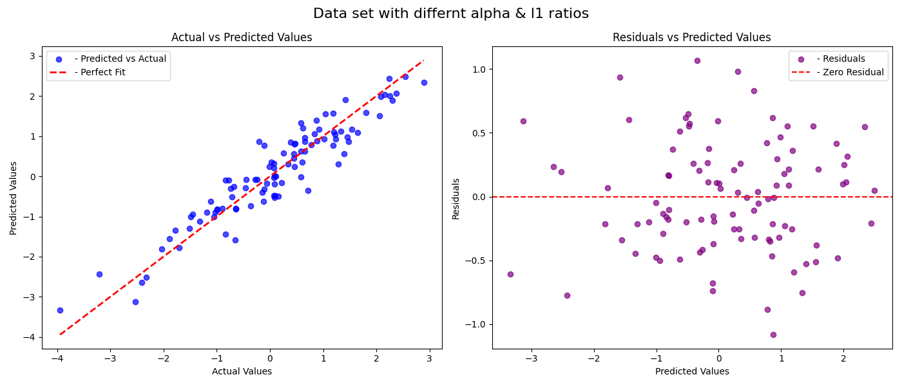
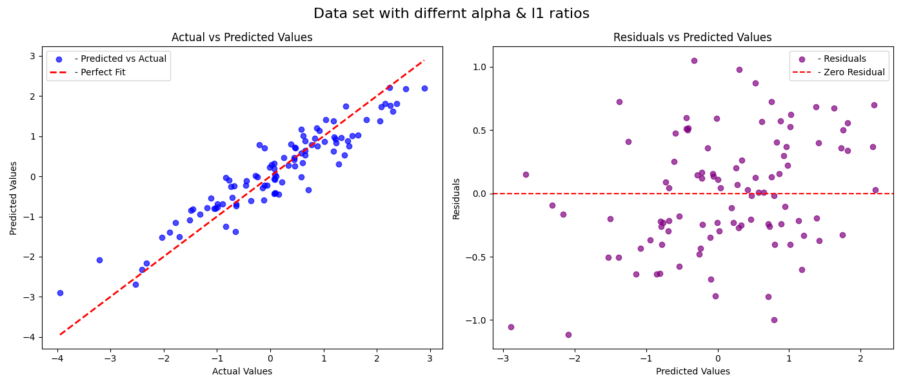
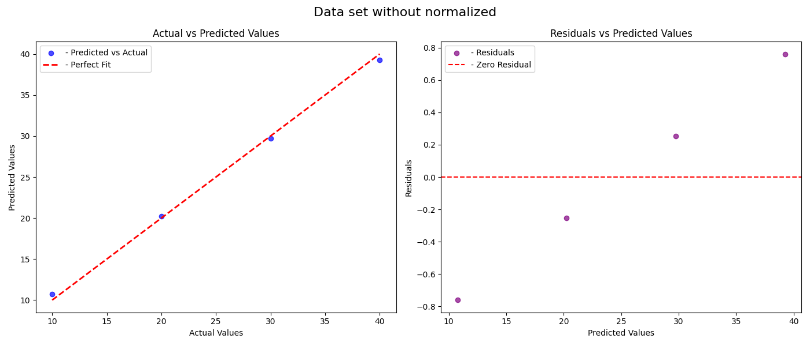

## Team Members
1. Ayyappa Boovadira Kushalappa **(A20555146)**
2. Binaal Bopanna Machanda Beliappa **(A20599896)**
3. Vikas Ravikumar Karjigi **(A20581687)**
4. Yashas Basavaraju **(A20586428)**

# ElasticNet Model Implementation

This repository includes a code of an **ElasticNet** regression model in the python language with the use of **NumPy** and also **Matplotlib**. The ElasticNet model is a linear regression model with elements of **Lasso (L1)** and the **Ridge (L2)** regularization. It is very useful when working with data which contains many highly correlated features or in case of features selection. The model used for the training is the **coordinate descent** algorithm.

## 1. What Does the Model Do and When Should It Be Used?

The **ElasticNetModel** works with linear regression but this model also requires that it provides L1 and L2 norms of the variable. The model is especially useful in the following scenarios:

- **Multicollinearity**: When the features are highly correlated, ElasticNet becomes handy at further minimizing variance, through L2 regulation.
- **Feature selection**: The L1 component also assists in moving many feature coefficients to zero and this is equivalent to feature selection.
- **Generalized regularization**: If Lasso (L1) and Ridge (L2) don’t solve the problem, models based on the combination of both give a more versatile result.

The model should be used in situations where:

- You have a high-dimensional data set.
- Multicollinearity among features.
- An optimal ratio between bias and variance is achievable.

## 2. How Did You Test Your Model to Determine If It Is Working Reasonably Correctly?

The strengths of the model has shown to work effectively through several test cases that met different tests. The tests were designed to ensure that the model behaves reasonably in different conditions:

1. **Test with a standard dataset**: We ran the model using a small test CSV file (`small_test.csv`) to check whether the model was capable to reasonable predictions and also compare the actual and predicted values showed a good correlation.

2. **Zero variance test**: This was done by feeding the model with a dataset that had a feature with no variance of values or standard deviation equal to 0 to see if the model can be robust enough to handle such a situation with its predictions being finite and reasonable.

3. **Highly correlated features test**: This tests the performance when the input features are correlated high, to see if ElasticNet is able to address multicollinearity well.

4. **Sparse data test**: Provided data with many zeros to the model in order to verify that the regularization works fine.

5. **Outliers test**: Examined how the model behaves in the presence of outliers making predictions bounded and increasing probability of yielding reasonable residual values.

6. **Large dataset test**: We investigated the prospects of the model using a large set of data in order to gauge scalability and robustness.

7. **Alpha and L1 ratio variation**: Tried different combination of `alpha` and `l1_ratio` to understand how both of them influencing the behavior of the model.

8. **Non-normalized data test**: Performs the task of checking the model on non-normalized data and making a check to see that the model does normalize the data properly while training.

Every single test calculates the **Mean Squared Error (MSE)**, **Mean Absolute Error (MAE)**, and **R-squared (R2)**; in addition, **scatter** and **residual plots** are created for the model.

## 3. What Parameters Have You Exposed to Users of Your Implementation in Order to Tune Performance?

The following parameters are exposed for tuning the performance of the ElasticNet model:

- **alpha**: Determines the degree of the regularization. A higher `alpha` leads to the extending of the penalty given to the coefficients and this can act as the counter measure to over fitting.
- **l1_ratio**: Decides the proportion of L1 and L2 norms of weights in regularization technique. `l1_ratio` parameter is above `[0,1]` interval, If `l1_ratio=0` then it corresponds to ridge regression or L2 regularization. If `l1_ratio=1`, then it corresponds to Lasso or L1 regularization. Any values in between allows the two methods to be used in combination.
- **max_iter**: The maximum number of iterations the coordinate descent algorithm will perform is set here.
- **tol**: The ability of the algorithm to accept the thresholds from stopping criteria. It is the point at which the variation of the coefficients between iterations is less than this value that the algorithm ceases.

- These parameters are well optimized in the code and users can further adjust these parameters according to its datasets.

## 4. Are There Specific Inputs That Your Implementation Has Trouble With? Given More Time, Could You Work Around These or Is It Fundamental to the Model?

### Specific Inputs:
- **Highly imbalanced datasets**: When the data has severe class imbalance or outliers, the ElasticNet model may not well perform because maximum outliers influences the regression line. Yet, this can be prevented through appropriate methods of outlier detection and basic preprocessing.
- **Non-linear relationships**: ElasticNet imposes the assumption that exhibits a linear form between the independent variables and the dependent variable. However, if the data contains complex non-linear ways of having information, then, the model in question might perform poorly. Some other enhancement could be done with non-linear models or feature engineering.

### Workarounds:
- **Imbalanced datasets**: Use data resampling, robust scaling, or applying data transformations related to the specific problem domain in order to better work with outliers.
- **Non-linear relationships**: More time would help to apply the model features like polynomial feature generation or kernel-based approach to reflect the non-linearity at the cost of the model’s complexity.

## Usage Instructions

### Installation

To get started with this project, first you need **Python 3.x**. Then follow these installation steps:

#### 1. Clone the Repository to your local machine:

```bash
git clone https://github.com/vikasrkarjigi/Project1.git
```
#### 2. Navigate to the project directory
```bash
cd ElasticNetModel
```
#### 3. You can install the required libraries using pip:
```bash
pip install numpy matplotlib
```
#### 4. Run the Test Script
```bash
python test_ElasticNetModel.py
```
This will run the test cases and print out the evaluation metrics and generate the plots.

### Basic Usage
To use the ElasticNet model, follow the example below:
```bash
from elasticnet.models.ElasticNet import ElasticNetModel
import numpy as numpy

# Create some synthetic data
X, y = numpy.random.rand(100, 3), numpy.random.rand(100)

# Initialize and fit the model
model = ElasticNetModel(alpha=1.0, l1_ratio=0.5, max_iter=1000, tol=1e-4)
model.fit(X, y)

# Predict using the trained model
predictions = model.predict(X)

# Evaluate the model
model.evaluate(X, y, "ElasticNet Model Synthetic Data")

```
### Test Case Outputs

Below are the screenshots showing the results of each test case included in this project:

- **test_predict()**: 
  Tests the model on a small dataset and verifies if the predictions are reasonable.
<div style="text-align: center;">
  
</div>

- **test_zero_variance_features()**: 
  Tests the model on a dataset where one feature has zero variance.
<div style="text-align: center;">
  
</div>

- **test_highly_correlated_features()**: 
  Tests the model on highly correlated features to ensure it handles multicollinearity appropriately.
 <div style="text-align: center;">
  
</div>

- **test_sparse_data()**: 
  Tests the model on sparse data with many zero entries to check if regularization works correctly.
<div style="text-align: center;">
  
</div>

- **test_with_outliers()**: 
  Tests the model on a dataset with outliers to ensure predictions remain reasonable.
<div style="text-align: center;">
  
</div>

- **test_large_dataset()**: 
  Evaluates the model on a large dataset to ensure scalability and stability.
<div style="text-align: center;">
  
</div>

- **test_different_alpha_l1_ratios()**: 
  Tests the model with various values for `alpha` and `l1_ratio` to evaluate the impact of these parameters on performance.
<div style="text-align: center;">
  
  
  
</div>

- **test_non_normalized_data()**: 
  Tests the model on non-normalized data to verify its ability to handle such inputs.
<div style="text-align: center;">
  
</div>

Each screenshot corresponds to the results from the respective test case and provides a `visual representation` of the model's performance under various conditions.

---

### Additional Features

In addition to the basic requirements, the following enhancements have been implemented to go above and beyond what was asked:

1. **Comprehensive Model Evaluation**:
   - Every test checks model performance depending on **Mean Squared Error (MSE)**, **Mean Absolute Error (MAE)** and **R-Squared (R2)**.
   - Besides, the model makes **residual** and **scatter plots** for the purpose of visual evaluation of predictions and residuals to attained further understanding of the model.

2. **Extensive Test Coverage**:
   - Explained many use cases: zero variance features, perfectly correlated features, sparse data, outliers, large datasets and different values of `alpha` and `l1_ratio`.
   - All these test cases are integrated into the `test_ElasticNetModel.py` in order to ensure it follows the right behavior in several conditions.

3. **Tolerance for Early Stopping**:
   - As a stopping criterion, there is another parameter known as `tol` parameter has been implemented. If this change in coefficients in two successive iterations is less than this value, it means the convergence between iterations is so rapid and therefore the coordinate descent algorithm will stop early to enhance efficiency of computations.

4. **Flexibility in Regularization**:
   - Made `alpha` and `l1_ratio` parameters available to the users, enabling mass control of the **L1/L2** regularizing option and tuning of the model according to the particular application.
   - To demonstrate how alpha and l1_ratio influence the outcome and strength of regularization on the prediction capability of the model, various sets of alpha and l1_ratio have been used.
   
These additional features and enhancements make the model functional as well as efficient, flexible and adaptable for the different approaches that can be applied in data.

### Conclusion
This particular work explores the ElasticNet method as a regularization technique in linear models, which allows users to control for multicollinearity as well as select features correctly in the given data. Thus, it is possible to adjust balance and strength of the regularization for various datasets via provided parameters.
